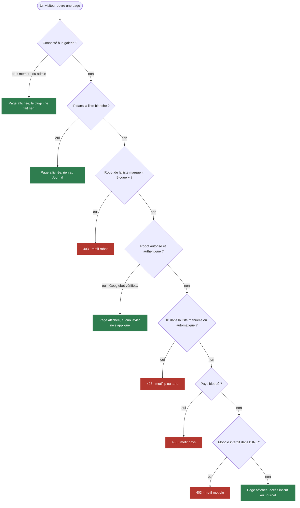
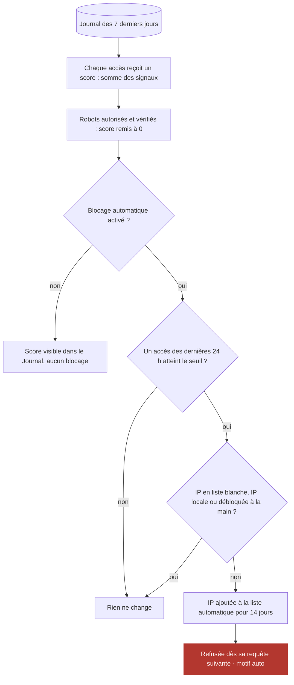

# IP Location — plugin Piwigo

*[English version](README_EN.md)*

Journal des visites non connectées avec géolocalisation, widget public des visites par
pays, et protection de la galerie contre les robots : liste de blocage, pays, mots-clés
d'URL, robots d'indexation et blocage automatique par score de suspicion.

Page du plugin : <https://piwigo.org/ext/extension_view.php?eid=1068>

Ce document explique **comment le plugin décide** de laisser passer ou de refuser un
visiteur. Il fonctionne en deux temps :

| Quand | Quoi |
|---|---|
| **À chaque page, en direct** | Une série de questions simples, dans un ordre fixe. La première qui dit « refuser » l'emporte : le visiteur reçoit une page d'erreur 403. Sinon la page s'affiche et l'accès est inscrit au Journal. |
| **Toutes les 4 h**, ou toutes les 10 min quand l'admin est ouvert | Le plugin relit le Journal des 7 derniers jours, donne à chaque accès un score de suspicion, et place les IP trop suspectes dans la liste de blocage automatique. Elles sont refusées dès leur requête suivante. |

Seuls les visiteurs **non connectés** sont concernés : un membre ou un administrateur
connecté n'est jamais contrôlé ni journalisé.

## 1. Une page est demandée

Chaque losange correspond à un levier de la page Configuration. Un levier éteint répond
toujours « non » : la question est simplement sautée.

- **L'ordre compte.** Un robot autorisé et vérifié (vrai Googlebot) passe avant les
  leviers : il n'est jamais bloqué par le pays ni par un mot-clé. Un faux Googlebot,
  démasqué par la vérification DNS, est traité comme n'importe quel visiteur.
- **Refus inscrits au Journal.** Un refus répété par la même IP pour le même motif n'est
  inscrit qu'une fois toutes les 10 minutes, pour ne pas noyer le Journal.
- **Robots très actifs.** Au-delà de 100 accès par jour, un robot autorisé et vérifié est
  seulement compté, sans ligne au Journal. Les compteurs l'incluent.
- **Téléchargement d'un original.** Il passe par un contrôle à part, le filtre pays des
  téléchargements. Si le pays n'est pas dans la liste autorisée, ou si la géolocalisation
  échoue, le téléchargement est refusé (motif téléchargement).

## 2. Le calcul du score, en arrière-plan

Seul le score peut bloquer automatiquement. Le seuil se règle avec le curseur du bloc
« Blocage automatique » (70 par défaut, 50 minimum conseillé).

### Les signaux et leur poids

| Signal | Ce qui le déclenche | Points | Marqué bot |
|---|---|--:|:-:|
| User-Agent vide | Le navigateur ne s'annonce pas du tout. | 10 | oui |
| User-Agent de robot | Contient bot, crawler, curl, python, scanner, cve-… ou annonce lui-même un robot (`compatible;`, adresse de contact). | 15 | oui |
| Navigateur obsolète | Firefox < 100, Chrome < 109, iOS < 14. | 20 | oui |
| Navigateur impossible | Numéro que Chrome ou macOS n'envoient plus depuis 2023 (`Chrome/150.0.9003.276` au lieu de `150.0.0.0`). | 30 | oui |
| Outil non navigateur | Le User-Agent ne commence pas par `Mozilla/`, comme le font tous les navigateurs. | 30 | non |
| Page d'un autre logiciel | L'IP demande `wp-login`, `rest_route`, `.env`… qu'un Piwigo ne sert jamais. Toutes ses lignes prennent les points. | 50 | non |
| Co-visitation | La même page ouverte par 2 IP différentes dans les mêmes 10 secondes (robots déclarés ou autorisés non comptés). | 30 | oui |
| Rafale sur une page | La même IP demande 3 fois la même page en 10 secondes. | 50 | oui |
| Rafale multi-pages | La même IP parcourt 20 pages différentes en 30 secondes. | 50 | oui |
| User-Agent partagé | Un même User-Agent vu 20 fois ou plus, avec 90 % d'IP différentes : réseau de proxies. | 30 | non |
| Pas de JavaScript | Au moins 2 accès et aucune trace du diaporama PhotoSwipe (si le thème l'utilise). | 20 | non |
| Faux robot | User-Agent de Googlebot, Bingbot… depuis une IP qui ne leur appartient pas (vérification DNS). | 50 | oui |

Les poids sont modifiables dans `local/config/config.inc.php` (voir
[PARAMETRES.md](PARAMETRES.md)). Les signaux faibles valent moins de 50 : il en faut au
moins deux pour franchir un seuil prudent.

## « Bot » et « bloqué » ne veulent pas dire la même chose

- **bot** est une étiquette : elle sert à trier le Journal, aux statistiques et au widget
  Visites. Elle ne bloque rien à elle seule.
- **bloqué** est un refus réel : le visiteur a reçu une page 403, pour l'un des motifs
  ci-dessous.

| Motif | Signification |
|---|---|
| robot | Robot de la liste marqué « Bloqué » (robots d'IA et outils SEO par défaut). |
| ip | IP ou plage ajoutée à la main à la liste de blocage. |
| auto | IP placée par le calcul du score, pour 14 jours. |
| pays | Pays de la liste des pays bloqués. |
| mot-clé | L'URL contient un mot interdit. Attention aux mots trop courants : `start` bloque la pagination des albums. |
| téléchargement | Original demandé depuis un pays non autorisé, ou non géolocalisé. |

## Le widget Visites

Il compte, par pays, les accès du Journal qui ressemblent à une vraie visite : ni bot, ni
bloqué, sur une page d'album ou de photo, et accompagnés d'une autre page de la même IP
(n'importe laquelle, accueil compris) dans la demi-heure qui précède ou qui suit. Une seule page isolée ne compte pas : c'est le comportement typique
d'un robot qui passe.
