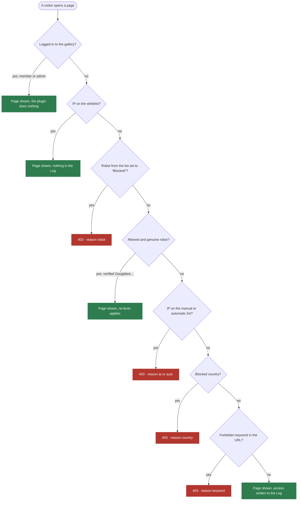
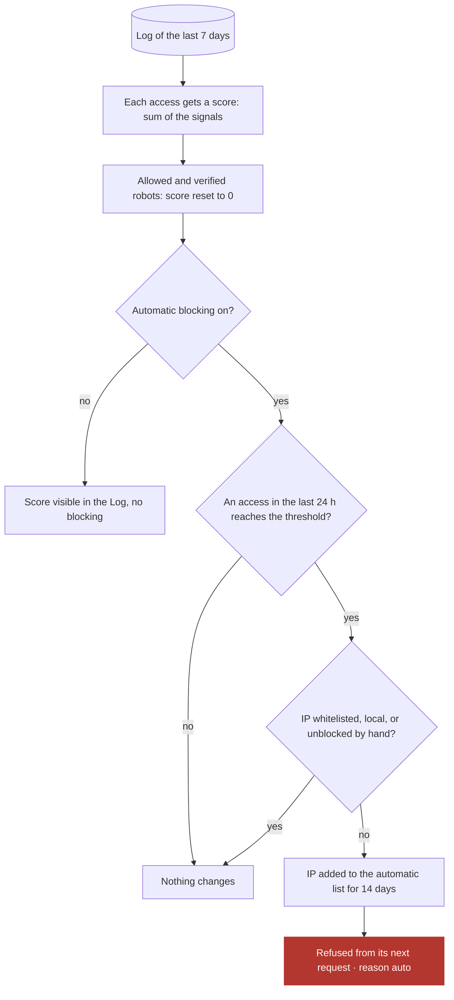

# IP Location — Piwigo plugin

*[Version française](README.md)*

Log of non-logged-in visits with geolocation, a public widget of visits per country, and
protection of the gallery against robots: block list, countries, URL keywords, indexing
robots and automatic blocking by suspicion score.

Plugin page: <https://piwigo.org/ext/extension_view.php?eid=1068>

This document explains **how the plugin decides** whether to let a visitor through or
refuse them. It works in two stages:

| When | What |
|---|---|
| **On every page, live** | A series of simple questions, in a fixed order. The first one that says "refuse" wins: the visitor gets a 403 error page. Otherwise the page is shown and the access is written to the Log. |
| **Every 4 h**, or every 10 min while the admin is open | The plugin rereads the Log of the last 7 days, gives each access a suspicion score, and puts IPs that are too suspicious on the automatic block list. They are refused from their next request. |

Only **non-logged-in** visitors are concerned: a logged-in member or administrator is
never checked nor logged.

## 1. A page is requested

Each diamond is a lever of the Configuration page. A lever that is switched off always
answers "no": the question is simply skipped.

- **Order matters.** An allowed and verified robot (real Googlebot) goes through before
  the levers: it is never blocked by country or by keyword. A fake Googlebot, exposed by
  the DNS check, is treated like any other visitor.
- **Refusals in the Log.** A refusal repeated by the same IP for the same reason is only
  written once every 10 minutes, so as not to flood the Log.
- **Very active robots.** Beyond 100 accesses a day, an allowed and verified robot is
  only counted, with no line in the Log. The counters include it.
- **Downloading an original.** It goes through a separate check, the download country
  filter. If the country is not on the allowed list, or if geolocation fails, the
  download is refused (reason download).

## 2. Score calculation, in the background

Only the score can block automatically. The threshold is set with the slider of the
"Automatic blocking" block (70 by default, 50 minimum recommended).

### Signals and their weight

| Signal | What triggers it | Points | Flagged bot |
|---|---|--:|:-:|
| Empty User-Agent | The browser does not identify itself at all. | 10 | yes |
| Robot User-Agent | Contains bot, crawler, curl, python, scanner, cve-… or declares itself a robot (`compatible;`, contact address). | 15 | yes |
| Outdated browser | Firefox < 100, Chrome < 109, iOS < 14. | 20 | yes |
| Impossible browser | A number Chrome or macOS no longer send since 2023 (`Chrome/150.0.9003.276` instead of `150.0.0.0`). | 30 | yes |
| Non-browser tool | The User-Agent does not start with `Mozilla/`, as every browser does. | 30 | no |
| Page of another software | The IP requests `wp-login`, `rest_route`, `.env`… that Piwigo never serves. All its lines get the points. | 50 | no |
| Co-visitation | The same page opened by 2 different IPs within the same 10 seconds (declared or allowed robots not counted). | 30 | yes |
| Single-page burst | The same IP requests the same page 3 times in 10 seconds. | 50 | yes |
| Multi-page burst | The same IP goes through 20 different pages in 30 seconds. | 50 | yes |
| Shared User-Agent | The same User-Agent seen 20 times or more, with 90 % different IPs: proxy network. | 30 | no |
| No JavaScript | At least 2 accesses and no trace of the PhotoSwipe slideshow (if the theme uses it). | 20 | no |
| Fake robot | User-Agent of Googlebot, Bingbot… from an IP that does not belong to them (DNS check). | 50 | yes |

The weights can be changed in `local/config/config.inc.php` (see
[PARAMETERS.md](PARAMETERS.md)). Weak signals are worth less than 50: at least two are
needed to reach a cautious threshold.

## "Bot" and "blocked" do not mean the same thing

- **bot** is a label: it is used to sort the Log, for statistics and for the Visits
  widget. It blocks nothing on its own.
- **blocked** is an actual refusal: the visitor got a 403 page, for one of the reasons
  below.

| Reason | Meaning |
|---|---|
| robot | Robot from the list set to "Blocked" (AI robots and SEO tools by default). |
| ip | IP or range added by hand to the block list. |
| auto | IP added by the score calculation, for 14 days. |
| country | Country on the blocked countries list. |
| keyword | The URL contains a forbidden word. Beware of words that are too common: `start` blocks album pagination. |
| download | Original requested from a country that is not allowed, or not geolocated. |

## The Visits widget

It counts, per country, the Log accesses that look like a real visit: neither bot nor
blocked, on an album or photo page, and together with another page from the same IP
(any page, home page included) in the half hour before or after. A single isolated page does not count: that is typical of a robot
passing by.
